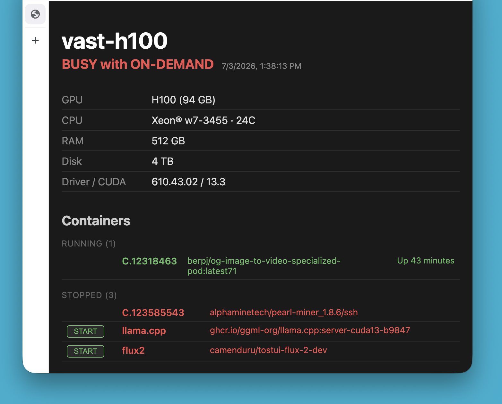

# vast.ai Node Status Page

Single-file Python web server that displays host hardware status (via vast.ai API) and Docker container inventory. Zero dependencies — stdlib only.



Goal: Use my rig whenever it's not occupied by Vast tasks.

Features:
- Display status of the rig (Busy / Available)
- Display specs of the rig
- Start / stop containers directly: only user's containers. Doesn't mess with Vast's containers

Roadmap:
- Start / stop containers on my own rigs via Vast API
- Start / stop deadload as soon as host is available
- Manage background (miner) load: stop during peak hours (1-9pm)

## Prerequisites

- Python 3.9+
- Docker (CLI + daemon) if you want the containers section

Credentials and log path are read from environment variables, with hardcoded
fallbacks in `server.py` lines 13–15:

| Env var      | Default             | Description              |
|--------------|---------------------|--------------------------|
| `MACHINE_ID` | -                   | vast.ai machine ID       |
| `API_KEY`    | -                   | vast.ai API key          |
| `LOG_FILE`   | `"./dashboard.log"` | request/API log path     |
| `PORT`       | `7000`              | HTTP listen port         |

## Logging

All web requests and vast.ai API calls are written to `LOG_FILE` (default
`./dashboard.log`). Each line is `ISO8601Z  message`.

Example:

    2026-07-03T04:56:43Z vast.ai GET https://console.vast.ai/api/v0/machines/…
    2026-07-03T04:56:43Z vast.ai OK hostname=vast5090 gpu=RTX 5090
    2026-07-03T04:56:43Z web GET / from 127.0.0.1
    2026-07-03T04:56:43Z web POST /start?name=my-container from 127.0.0.1

## Docker access

The script runs `docker ps -a`. So, you need either to run script as rooot, or use user with the membership in the `docker` group:

```bash
sudo usermod -aG docker $USER
newgrp docker          # apply without logout
```

Verify:

```bash
docker ps
```

## Quick start

```bash
MACHINE_ID=123 API_KEY=your-key python3 server.py
# → listening on :7000
```

Visit `http://<node-ip>:7000/`.

## Install as a systemd service (auto-start on boot)

sudo nano /etc/systemd/system/vast-status.service

```bash
[Unit]
Description=vast.ai node dashboard page
After=network.target docker.service
Wants=docker.service

[Service]
Type=simple
User=root
ExecStart=/usr/bin/python3 /opt/vast-status/server.py
Restart=always
RestartSec=5
Environment=PORT=7000
Environment=MACHINE_ID=123
Environment=API_KEY=your-vast-api-key
Environment=LOG_FILE=/var/log/dashboard.log

[Install]
WantedBy=multi-user.target
```

Copy the script into place and enable:

```bash
sudo mkdir -p /opt/vast-status
sudo cp server.py /opt/vast-status/
sudo systemctl daemon-reload
sudo systemctl enable --now vast-status
sudo systemctl status vast-status
```

- **User:** set to the user that can talk to Docker (often `root` on vast.ai
  instances, or your own user if it's in the `docker` group).
- **Port:** Vast.ai maps a range of ports to the instance's public IP. Check
  your rental's port mappings and set `PORT` accordingly.

## Endpoints

| Path                | Method | Description                                   |
|---------------------|--------|-----------------------------------------------|
| `/`                 | GET    | HTML dashboard (hardware + containers)         |
| `/health`           | GET    | Plain-text `ok` for health checks             |
| `/start?name=<c>`   | POST   | Start container `<c>` (returns JSON)          |
| `/stop?name=<c>`    | POST   | Stop container `<c>` (returns JSON)           |

Container names matching `C.*` get no action buttons.
Container names are validated — only `[a-zA-Z0-9_.-]` allowed.
